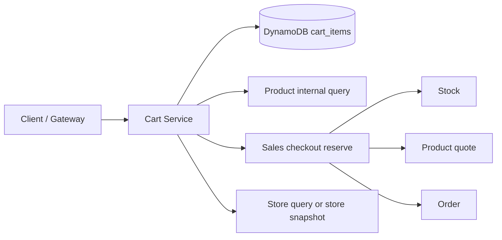
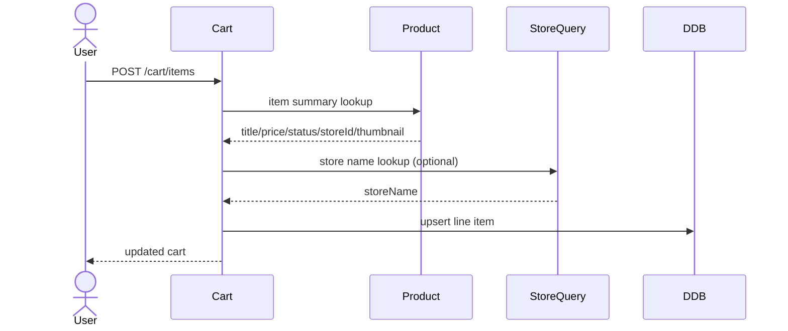
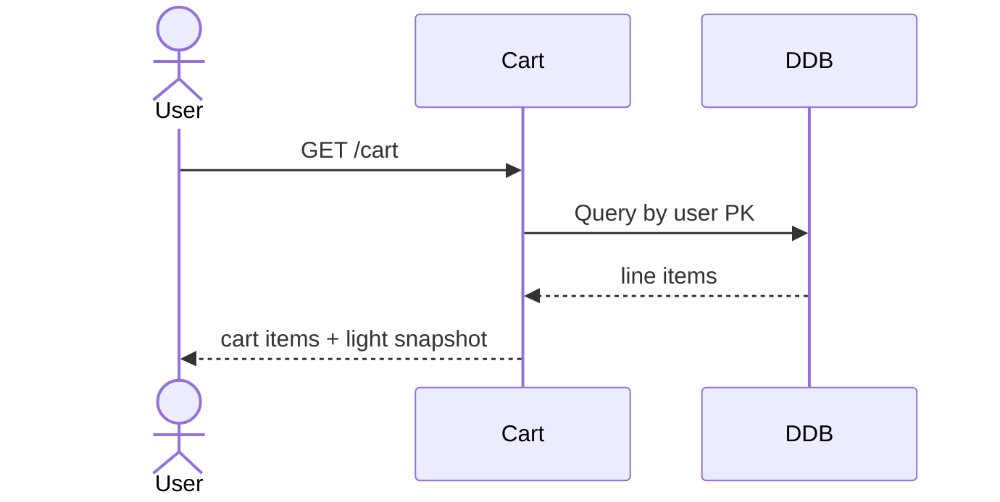
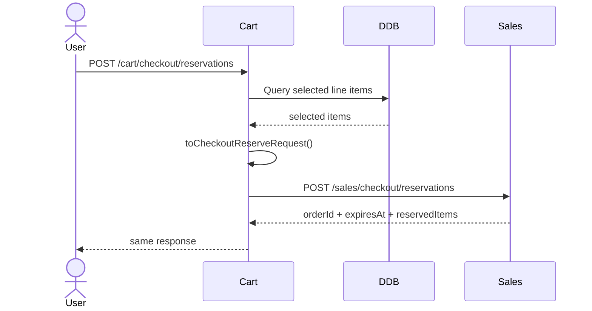

# Feature Design

## Overview

`cart` 는 구매 정본 서비스가 아니라 `sales checkout reserve` 앞단의 구매 의도 저장소다.

이번 설계의 핵심은 다음과 같다.

1. 장바구니 API 는 Spring Boot 서비스로 제공한다.
2. 장바구니 저장은 DynamoDB 를 사용한다.
3. 장바구니는 `itemId/referenceId/quantity/channelType/channelRefId` 같은 구매 의도와 조회 UX 용 light snapshot 만 가진다.
4. 가격 확정, 재고 예약, 주문 생성은 기존 `sales -> product -> stock -> order` 흐름을 그대로 재사용한다.
5. 장바구니는 완전한 catalog read-model 이 아니며, downstream 정본의 대체물이 아니다.

이 설계는 세 가지 목표를 동시에 만족시키려 한다.

- 장바구니 조회 UX 를 충분히 빠르게 만든다.
- 상품/가게/미디어 이벤트를 장바구니가 전부 따라가는 무거운 read-model 구조는 피한다.
- 사용자가 장바구니에서 바로 checkout 으로 넘어갈 수 있게 `sales reserve` 입력 shape 와 정렬한다.

## Architecture



### Responsibility Boundary

`cart` 가 담당하는 것:

- 사용자별 장바구니 line item 저장
- 수량/선택 상태 변경
- light snapshot 보관
- 선택 line item 을 `sales reserve` payload 로 변환
- `sales reserve` 호출 위임

`cart` 가 담당하지 않는 것:

- 가격 확정
- 재고 확정
- 주문 정본 저장
- 결제 이후 상태 관리
- 상품/가게/미디어 전체 UX projection 유지

## Key Design Decisions

### 1. Thin Cart + Light Snapshot

저장 필드는 두 층으로 나눈다.

- 구매 의도 정본
  - `itemId`
  - `referenceId`
  - `quantity`
  - `channelType`
  - `channelRefId`
  - `stockItemType`
  - `selected`
- 조회 편의 snapshot
  - `storeId`
  - `itemTitle`
  - `thumbnailUrl`
  - `storeName`
  - `displayPrice`
  - `salesStatus`

이 snapshot 은 stale 될 수 있지만, checkout 직전 `sales` 가 다시 `product quote` 와 `stock reserve` 를 태우므로 정합성의 근거는 여전히 downstream 서비스에 있다.

### 2. Sales-First Checkout Integration

장바구니에서 checkout 을 시작할 때 `cart` 는 자체적으로 가격 계산이나 재고 확인을 하지 않는다.

대신 선택된 line item 을 현재 `sales` 의 첫 진입점 shape 로 변환한다.

대상 shape:

```json
{
  "idempotencyKey": "uuid",
  "lineItems": [
    {
      "itemId": 930001,
      "channelType": "NORMAL",
      "channelRefId": null,
      "stockItemType": "ITEM_OPTION",
      "referenceId": 930101,
      "quantity": 2
    }
  ]
}
```

즉 `cart` 는 `sales reserve payload producer` 이고, 실제 orchestration 은 계속 `sales` 가 담당한다.

### 3. DynamoDB Single-Table Pattern for Cart Lines

MVP 에서는 cart meta item 을 두지 않고, line item 중심 single-table 형태를 사용한다.

이유:

- 주요 access pattern 이 모두 `userId 기준 전체 조회` 또는 `특정 line item 수정`이다.
- line item 단위 upsert/delete 가 많고, cart 전체 transaction 이 필수인 규칙이 적다.
- DynamoDB Query 중심으로 충분히 해결 가능하다.

## Components and Interfaces

### 1. Cart Query API

예상 엔드포인트:

- `GET /api/v1/cart`

역할:

- 로그인 사용자 기준 장바구니 조회
- line item 목록과 light snapshot 반환
- 필요 시 만료된 item 필터링

응답 예시:

```json
{
  "items": [
    {
      "itemId": 930001,
      "referenceId": 930101,
      "quantity": 2,
      "channelType": "NORMAL",
      "channelRefId": null,
      "stockItemType": "ITEM_OPTION",
      "selected": true,
      "storeId": 11,
      "itemTitle": "MZC 티셔츠",
      "thumbnailUrl": "https://...",
      "storeName": "MZC Store",
      "displayPrice": 12000,
      "salesStatus": "ON_SALE",
      "updatedAt": "2026-03-13T00:00:00"
    }
  ]
}
```

### 2. Cart Command API

예상 엔드포인트:

- `POST /api/v1/cart/items`
- `PATCH /api/v1/cart/items`
- `DELETE /api/v1/cart/items`
- `PATCH /api/v1/cart/items/selection`
- `POST /api/v1/cart/checkout/reservations`

역할:

- add/upsert
- quantity 변경
- 선택 상태 변경
- 삭제
- selected item 기준 `sales reserve` 호출 위임

### 3. Cart Application Service

역할:

- 로그인 사용자 식별자 해석
- repository load/save
- snapshot enrichment 호출
- checkout delegation

인터페이스 초안:

```java
public interface CartService {
    CartResponse getCart(Long userId);
    CartResponse addItem(Long userId, AddCartItemCommand command);
    CartResponse updateQuantity(Long userId, UpdateCartQuantityCommand command);
    CartResponse changeSelection(Long userId, ChangeCartSelectionCommand command);
    CartResponse removeItem(Long userId, RemoveCartItemCommand command);
    CheckoutReserveResponse startCheckout(Long userId, StartCartCheckoutCommand command);
}
```

### 4. Domain Model

#### `Cart`

in-memory aggregate 역할

- line item 집합 보유
- 동일 identity line merge
- empty selection 검증
- selected line -> `CheckoutReserveRequest` 변환

핵심 메서드:

```java
public class Cart {
    void addOrMerge(CartLine line);
    void changeQuantity(CartLineIdentity identity, int quantity);
    void select(CartLineIdentity identity, boolean selected);
    void remove(CartLineIdentity identity);
    List<CartLine> selectedLines();
    CheckoutReserveRequest toCheckoutReserveRequest(String idempotencyKey);
}
```

#### `CartLine`

역할:

- line identity 보유
- quantity/selection/self validation
- snapshot refresh

identity 는 아래 조합이다.

- `itemId`
- `referenceId`
- `channelType`
- `channelRefId`

### 5. Cart Snapshot Enricher

역할:

- add/upsert 시 light snapshot 을 best-effort 로 채운다.
- 외부 조회 실패 시 최소 식별 정보 저장은 계속 허용한다.

1차 source:

- `product internal item query`
  - `title`
  - `price`
  - `status`
  - `storeId`
  - `thumbnail`

2차 source:

- `store-query` 또는 `store` snapshot
  - `storeName`

정책:

- enrichment 실패는 line 저장 전체 실패 사유가 아니다.
- checkout 정합성은 enrichment 가 아니라 `sales` 단계에서 보장한다.

### 6. Sales Checkout Delegator

역할:

- cart selected lines -> `CheckoutReserveRequest`
- `sales /checkout/reservations` 동기 호출
- response pass-through

정책:

- `cart` 는 `reserve` 이후 상태를 저장하지 않는다.
- `orderId` 와 `expiresAt` 는 `sales` 응답으로만 전달한다.
- checkout 실패 시 cart line item 은 유지한다.

## Data Models

### DynamoDB Table: `cart_items`

기본 키:

- `PK = USER#{userId}`
- `SK = LINE#ITEM#{itemId}#REF#{referenceId}#CH#{channelType}#CR#{channelRefIdOrNONE}`

예시:

- `PK = USER#1001`
- `SK = LINE#ITEM#930001#REF#930101#CH#NORMAL#CR#NONE`

속성:

- `userId`
- `itemId`
- `referenceId`
- `quantity`
- `channelType`
- `channelRefId`
- `stockItemType`
- `selected`
- `storeId`
- `itemTitle`
- `thumbnailUrl`
- `storeName`
- `displayPrice`
- `salesStatus`
- `createdAt`
- `updatedAt`
- `expiresAtEpoch`
- `version`

TTL:

- `expiresAtEpoch`

MVP 에서는 별도 GSI 를 두지 않는다.

### Access Patterns

1. 사용자 장바구니 전체 조회
- `Query PK = USER#{userId}`

2. 특정 line item upsert
- `PutItem` 또는 `UpdateItem` by `PK + SK`

3. 특정 line item 삭제
- `DeleteItem` by `PK + SK`

## Persistence Strategy

### Repository Technology Choice

Spring Boot 서비스 내부에서는 AWS SDK for Java v2 `DynamoDbEnhancedClient` 를 사용한다.

선택 이유:

- AWS 공식 Java v2 경로다.
- low-level attribute map 보다 매핑 코드가 단순하다.
- Spring Boot 서비스 안에서 repository abstraction 을 만들기 쉽다.

### Write Strategy

#### Add / Upsert

- 동일 PK/SK 존재 시 quantity merge 또는 overwrite
- conditional update 또는 version 증가 사용

#### Quantity Change

- line item 단건 update
- quantity 가 1 이상인지 도메인 검증

#### Selection Change

- 단건 update

## Sequence Design

### 1. Add Item



### 2. List Cart



### 3. Checkout From Cart



## Error Handling

### Validation Errors

- quantity <= 0
- selected checkout item 없음
- 사용자 식별자 없음
- 잘못된 `channelType`
- 잘못된 `referenceId`

처리:

- 4xx business error 반환
- 기존 cart 데이터는 유지

### Snapshot Enrichment Failure

상황:

- product internal query 실패
- store name 조회 실패

정책:

- 최소 line item 저장은 허용
- snapshot 필드는 null 허용
- 조회 응답은 fallback 가능한 필드만 반환

### Checkout Delegation Failure

상황:

- `sales reserve` 실패
- downstream timeout
- 재고 부족

정책:

- cart line item 은 삭제하지 않음
- `sales` 에서 내려준 오류를 최대한 보존
- 사용자는 quantity/선택 상태를 조정 후 재시도 가능

### TTL / Expiration

정책:

- DynamoDB TTL 은 저장 비용 정리 용도다.
- 앱은 조회 시 `expiresAtEpoch` 가 지난 line item 을 만료 대상으로 취급할 수 있다.
- TTL 삭제는 즉시성을 보장하지 않으므로 비즈니스 만료 판단을 TTL 삭제 시점에 의존하지 않는다.

## Testing Strategy

### Unit Tests

- `CartLine` quantity validation
- `Cart` add/remove/select behavior
- duplicate identity merge
- selected line -> checkout payload 변환

### Repository Tests

- PK query 로 전체 cart 조회
- PK/SK 기준 단건 upsert/delete
- TTL attribute 저장 확인
- optimistic write or conditional write 동작 확인

### Integration Tests

- add -> list -> quantity change -> delete
- snapshot enrichment success/failure fallback
- cart -> sales reserve delegation

### E2E Tests

- cart add 후 checkout reserve 까지 성공
- cross-store line items checkout delegation
- mixed `NORMAL/FUNDING` line items handoff
- stale snapshot 이 있어도 sales 에서 최신 검증으로 실패/성공하는지 확인

## Operational Notes

- 장바구니 조회는 DynamoDB `Query` 만 사용하고 `Scan` 은 사용하지 않는다.
- 장바구니는 세션성 데이터이므로 TTL 정리를 전제로 한다.
- checkout 정합성 이슈는 cart 가 아니라 `sales/product/stock` 에서 최종 검증한다.
- 장바구니 응답의 `displayPrice` 는 결제 확정 금액이 아니라 표시용 값이다.

## References

- AWS Lambda best practices  
  https://docs.aws.amazon.com/lambda/latest/dg/best-practices.html
- DynamoDB data modeling building blocks  
  https://docs.aws.amazon.com/amazondynamodb/latest/developerguide/data-modeling-blocks.html
- DynamoDB TTL  
  https://docs.aws.amazon.com/amazondynamodb/latest/developerguide/TTL.html
- DynamoDB query vs scan best practices  
  https://docs.aws.amazon.com/amazondynamodb/latest/developerguide/bp-query-scan.html
- DynamoDB transactions  
  https://docs.aws.amazon.com/amazondynamodb/latest/developerguide/transaction-apis.html
- AWS SDK for Java v2 Enhanced Client  
  https://docs.aws.amazon.com/sdk-for-java/latest/developer-guide/ddb-en-client-getting-started-dynamodbTable.html
