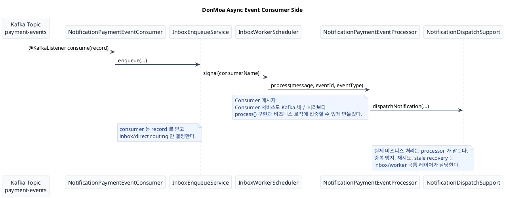

# DonMoa Async Event Communication

이 문서는 비동기 서비스 간 통신 설계/구현 파트만 따로 설명하기 위한 마크다운이다.  
발표에서는 `동기 Facade` 다음에 붙여서, `비동기도 서비스 코드에서는 단순하게 보이도록 추상화했다`는 메시지로 이어가면 된다.

## 핵심 메시지

- Producer 서비스는 `eventPublisher.publish()`만 호출한다.
- Kafka 발행, 재시도, 유실 방지 같은 복잡도는 `outbox` 레이어가 맡는다.
- Consumer 서비스는 `@KafkaListener`와 `processor` 구현만 신경 쓰면 된다.
- 중복 방지, inbox 적재, 재처리, stale recovery 같은 복잡도는 `inbox` 레이어가 맡는다.
- 결과적으로 비동기 통신도 서비스 코드 관점에서는 단순해지고 DX가 좋아진다.

## 발표 흐름 추천

1. `비동기 통신도 서비스 코드에서는 publish()로 추상화했다`
2. `이벤트 유실/재시도/중복 처리는 outbox/inbox 패턴으로 공통화했다`
3. `producer / consumer 코드가 실제로 단순해진다`
4. `그래서 서비스는 비즈니스 로직에 집중할 수 있다`

## 코드 캡처 추천

Producer 쪽:
- [PaymentCommandService.java](/Users/ddingjoo/IdeaProjects/MZC/Project/3rdProject/servers/services/payment/src/main/java/com/example/payment/service/command/PaymentCommandService.java#L79)

Consumer 쪽:
- [NotificationPaymentEventConsumer.java](/Users/ddingjoo/IdeaProjects/MZC/Project/3rdProject/servers/services/notification/src/main/java/com/example/notification/consumer/payment/NotificationPaymentEventConsumer.java#L12)
- [NotificationPaymentEventProcessor.java](/Users/ddingjoo/IdeaProjects/MZC/Project/3rdProject/servers/services/notification/src/main/java/com/example/notification/consumer/payment/NotificationPaymentEventProcessor.java#L18)

공통 인프라 쪽:
- [OutboxService.java](/Users/ddingjoo/IdeaProjects/MZC/Project/3rdProject/libs/event/outbox/src/main/java/com/example/event/outbox/OutboxService.java#L17)
- [ImmediatePublisher.java](/Users/ddingjoo/IdeaProjects/MZC/Project/3rdProject/libs/event/outbox/src/main/java/com/example/event/outbox/ImmediatePublisher.java#L15)
- [OutboxRelayScheduler.java](/Users/ddingjoo/IdeaProjects/MZC/Project/3rdProject/libs/event/outbox/src/main/java/com/example/event/outbox/OutboxRelayScheduler.java#L13)
- [InboxEnqueueService.java](/Users/ddingjoo/IdeaProjects/MZC/Project/3rdProject/libs/event/inbox/src/main/java/com/example/event/inbox/InboxEnqueueService.java#L13)
- [InboxWorkerScheduler.java](/Users/ddingjoo/IdeaProjects/MZC/Project/3rdProject/libs/event/inbox/src/main/java/com/example/event/inbox/InboxWorkerScheduler.java#L19)

## 설명용 문장

`비동기 통신도 서비스 코드에서는 eventPublisher.publish()만 보이게 만들었습니다.`

`대신 이벤트 유실 방지와 즉시 발행 실패 시 재시도는 outbox가 맡고, 소비자 쪽 중복 방지와 재처리는 inbox가 맡도록 공통화했습니다.`

`그래서 producer 서비스는 이벤트 발행만, consumer 서비스는 실제 processor 구현만 신경 쓰면 되도록 DX를 개선했습니다.`

## PlantUML: Producer Diagram

```puml
@startuml
title DonMoa Async Event Producer Side

skinparam backgroundColor #FFFFFF
skinparam shadowing false
skinparam sequence {
  ArrowColor #334155
  LifeLineBorderColor #94A3B8
  LifeLineBackgroundColor #FFFFFF
  ParticipantBorderColor #CBD5E1
  ParticipantBackgroundColor #F8FAFC
  ParticipantFontColor #0F172A
}

skinparam note {
  BackgroundColor #EFF6FF
  BorderColor #93C5FD
  FontColor #1E3A8A
}

participant "PaymentCommandService" as PaymentService
participant "EventPublisher\n(OutboxService)" as OutboxService
participant "OutboxRepository" as OutboxRepo
participant "ImmediatePublisher" as ImmediatePublisher
participant "OutboxRelayScheduler" as Relay
participant "Kafka Topic\npayment-events" as Kafka

PaymentService -> OutboxService : publish(PaymentCompletedEvent, metadata)
OutboxService -> OutboxRepo : save OutboxMessage
OutboxService -> ImmediatePublisher : OutboxSavedEvent
ImmediatePublisher -> Kafka : publish async

alt immediate publish failed
  ImmediatePublisher -> Relay : revert to pending
  Relay -> OutboxRepo : fetch pending messages
  Relay -> Kafka : retry publish
end

note right of PaymentService
서비스는 결제 완료 후
eventPublisher.publish() 만 호출한다.
Kafka 전송 코드는 직접 다루지 않는다.
end note

note right of OutboxService
이벤트 유실 방지를 위해
먼저 outbox 에 저장한 뒤
after-commit 시점에 발행을 트리거한다.
end note

note bottom
Producer 메시지:
비동기 발행도 서비스 코드에서는 publish() 한 줄로 보이게 만들고,
outbox / immediate publish / relay retry 는 공통 레이어가 맡도록 했다.
end note

@enduml
```

## PlantUML: Consumer Diagram


