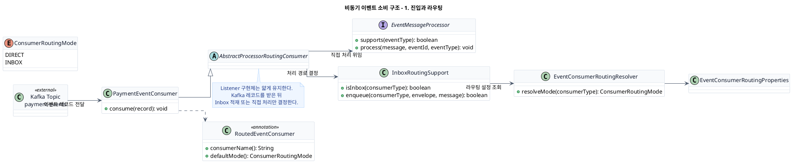
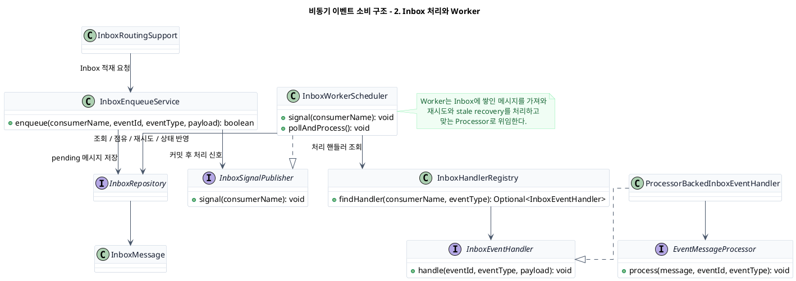
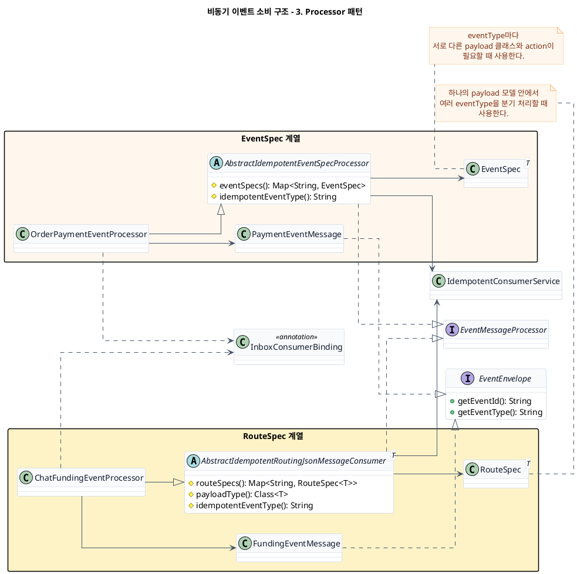
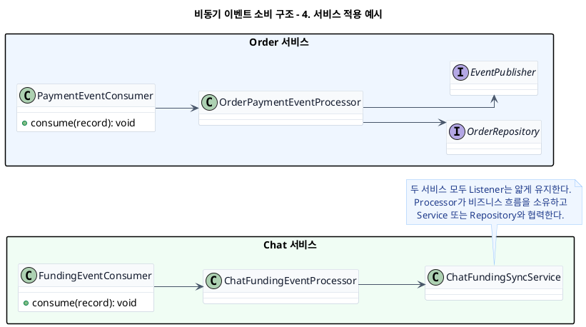

# 비동기 이벤트 소비 다이어그램 모음

PPT에 바로 옮기기 쉽게 박스형 다이어그램과 설명을 한곳에 모아둔 문서다.

## 1. 진입과 라우팅

파일: [donmoa-async-event-consumer-slide-1-entry-routing.puml](./donmoa-async-event-consumer-slide-1-entry-routing.puml)

설명:
- `PaymentEventConsumer`는 Kafka에서 메시지를 받는 실제 진입 클래스다.
- 이 클래스는 메시지를 직접 처리하지 않고 공통 라우팅 구조로 넘긴다.
- `InboxRoutingSupport`가 Inbox 적재 여부를 판단하고, 직접 처리라면 `EventMessageProcessor`로 위임한다.

발표 포인트:
- "핵심은 Listener를 얇게 유지하는 것입니다."
- "메시지를 받자마자 비즈니스 로직으로 들어가지 않고, 먼저 공통 라우팅 계층을 거칩니다."

## 2. Inbox 처리와 Worker

파일: [donmoa-async-event-consumer-slide-2-inbox-worker.puml](./donmoa-async-event-consumer-slide-2-inbox-worker.puml)

설명:
- `InboxEnqueueService`는 메시지를 바로 실행하지 않고 먼저 저장한다.
- `InboxWorkerScheduler`는 저장된 메시지를 가져와 재시도와 복구를 포함해 처리한다.
- `InboxHandlerRegistry`를 통해 어떤 Processor가 이 메시지를 맡아야 하는지 찾아 연결한다.

발표 포인트:
- "Inbox를 두는 이유는 안정성 때문입니다."
- "중복 메시지, 일시 장애, 재처리를 공통 계층에서 해결합니다."

## 3. Processor 패턴

파일: [donmoa-async-event-consumer-slide-3-processor-patterns.puml](./donmoa-async-event-consumer-slide-3-processor-patterns.puml)

설명:
- Processor는 실제 비즈니스 처리 직전의 핵심 계층이다.
- `EventSpec` 계열은 이벤트 타입마다 다른 payload와 액션이 필요한 경우에 적합하다.
- `RouteSpec` 계열은 하나의 payload 모델 안에서 여러 이벤트 타입을 분기할 때 적합하다.

발표 포인트:
- "서비스마다 Processor 구현 방식은 조금 다르지만 목적은 같습니다."
- "멱등 처리와 이벤트 분기를 Processor에서 통제합니다."

## 4. 서비스 적용 예시

파일: [donmoa-async-event-consumer-slide-4-service-examples.puml](./donmoa-async-event-consumer-slide-4-service-examples.puml)

설명:
- `Order 서비스`는 결제 이벤트를 받아 주문 상태를 바꾸고 후속 이벤트를 발행한다.
- `Chat 서비스`는 펀딩 이벤트를 받아 채팅방과 참여자 상태를 동기화한다.
- 공통 구조는 같고, Processor 뒤쪽의 비즈니스 역할만 달라진다.

발표 포인트:
- "구조를 공통화했기 때문에 서비스마다 Listener를 새로 설계할 필요가 없습니다."
- "각 서비스는 자기 Processor와 도메인 로직에만 집중할 수 있습니다."

