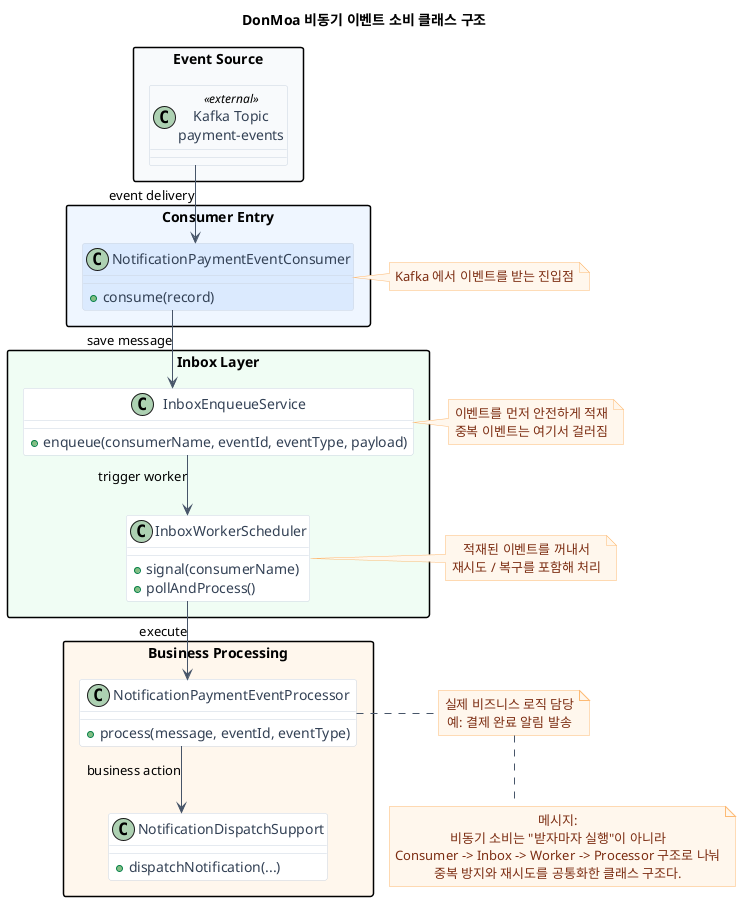
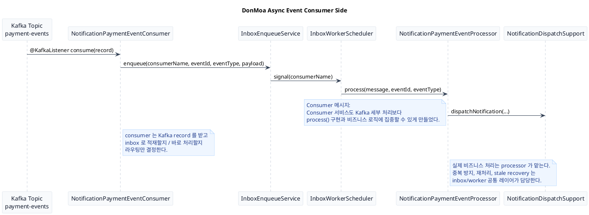

# DonMoa Async Event Consumer Presentation

이 문서는 비동기 소비 파트를 발표 슬라이드 순서대로 정리한 자료다.
권장 순서는 아래와 같다.

1. 클래스 다이어그램
2. 시퀀스 다이어그램
3. 코드 예시

---

## Slide 1. 클래스 다이어그램

### 제목

`비동기 이벤트를 안전하게 소비하는 구조`

### 핵심 메시지

- 이벤트를 받자마자 바로 비즈니스 로직을 실행하지 않는다.
- 먼저 안전하게 저장하고, 같은 이벤트인지 확인한 뒤, 처리기를 통해 후속 작업을 실행한다.
- 그래서 소비 서비스는 Kafka 세부 처리보다 실제 비즈니스 처리에 집중할 수 있다.

### 발표 멘트

`저희는 비동기 소비도 단순히 리스너에서 바로 처리하지 않고, 먼저 안전하게 보관한 뒤 중복 여부를 확인하고 처리하는 구조로 만들었습니다. 그래서 알림 같은 후속 작업을 중복 없이 안정적으로 실행할 수 있습니다.`

### PlantUML



---

## Slide 2. 시퀀스 다이어그램

### 제목

`이벤트 소비 흐름`

### 핵심 메시지

- Kafka에서 이벤트를 받으면 consumer가 직접 비즈니스 로직을 수행하지 않는다.
- inbox 적재와 worker를 거쳐 processor가 처리한다.
- 즉, 소비 흐름도 공통 레이어를 통해 표준화돼 있다.

### 발표 멘트

`이벤트가 들어오면 consumer는 record를 받고 바로 처리하지 않고, inbox 적재와 worker 실행을 통해 후속 처리로 넘깁니다. 실제 비즈니스 로직은 processor가 담당하고, 공통 레이어가 중복 방지와 재시도 같은 안정성 문제를 맡습니다.`

### PlantUML



---

## Slide 3. 코드 예시

### 제목

`실제 구현 코드`

### 핵심 메시지

- Producer는 `publish()`만 호출한다.
- Consumer는 `consume()` 진입점만 가진다.
- 실제 비즈니스 처리는 `processor`가 담당한다.
- inbox 적재와 worker 재시도는 공통 인프라가 맡는다.

### 코드 예시 1. Producer

파일: [PaymentCommandService.java](/Users/ddingjoo/IdeaProjects/MZC/Project/3rdProject/servers/services/payment/src/main/java/com/example/payment/service/command/PaymentCommandService.java#L79)

```java
eventPublisher.publish(
        new PaymentCompletedEvent(
                payment.getId(),
                payment.getOrderId(),
                payment.getUserId(),
                payment.getAmount(),
                paidAt
        ),
        EventMetadata.of("Payment", String.valueOf(payment.getId()))
);
```

발표 포인트:
`서비스 코드에서는 KafkaTemplate이나 outbox 저장 로직이 아니라 publish() 호출만 보입니다.`

### 코드 예시 2. Consumer Entry

파일: [NotificationPaymentEventConsumer.java](/Users/ddingjoo/IdeaProjects/MZC/Project/3rdProject/servers/services/notification/src/main/java/com/example/notification/consumer/payment/NotificationPaymentEventConsumer.java#L12)

```java
@Component
@RoutedEventConsumer(
        consumerName = NotificationPaymentEventProcessor.CONSUMER_NAME,
        defaultMode = ConsumerRoutingMode.INBOX
)
public class NotificationPaymentEventConsumer extends AbstractProcessorRoutingConsumer {

    @KafkaListener(topics = "payment-events", groupId = "${spring.kafka.consumer.group-id}")
    @Transactional
    public void consume(ConsumerRecord<String, Object> record) {
        consumeRecord(record);
    }
}
```

발표 포인트:
`consumer 진입점은 record를 받고 공통 consumeRecord()에 넘기는 정도로 단순합니다.`

### 코드 예시 3. Processor

파일: [NotificationPaymentEventProcessor.java](/Users/ddingjoo/IdeaProjects/MZC/Project/3rdProject/servers/services/notification/src/main/java/com/example/notification/consumer/payment/NotificationPaymentEventProcessor.java#L18)

```java
@Component
@InboxConsumerBinding(consumerName = NotificationPaymentEventProcessor.CONSUMER_NAME)
public class NotificationPaymentEventProcessor extends AbstractIdempotentEventSpecProcessor {

    private void handlePaymentCompleted(PaymentEventMessage event) {
        notificationDispatchSupport.dispatchNotification(
                event.getUserId(),
                NotificationType.PAYMENT,
                "ORDER",
                event.getOrderId(),
                event.getEventId(),
                "결제가 완료되었습니다",
                "결제 건 #" + notificationDispatchSupport.safeValue(event.getPaymentId()) + "이(가) 정상 처리되었습니다.",
                variables
        );
    }
}
```

발표 포인트:
`실제 비즈니스 로직은 processor가 맡고, consumer는 진입점 역할에 머뭅니다.`

### 코드 예시 4. Inbox Retry / Recovery

파일: [InboxWorkerScheduler.java](/Users/ddingjoo/IdeaProjects/MZC/Project/3rdProject/libs/event/inbox/src/main/java/com/example/event/inbox/InboxWorkerScheduler.java#L197)

```java
if (message.exceedsRetryLimitOnNextFailure(maxRetryCount)) {
    message.markDead(now, reason, maxErrorLength);
} else {
    long delaySeconds = computeBackoffSeconds(message.nextRetryCount());
    message.markRetry(now, now.plusSeconds(delaySeconds), reason, maxErrorLength);
}
```

발표 포인트:
`실패 시 dead 처리와 지수 백오프 재시도는 공통 worker가 맡고, 서비스 코드에는 드러나지 않습니다.`

---

## 최종 메시지

`비동기 소비에서는 이벤트를 바로 실행하지 않고 안전하게 저장한 뒤, 중복 여부를 확인하고 실패하면 다시 처리하도록 설계했습니다. 그래서 producer는 publish()만, consumer는 process()만 신경 쓰면 되도록 만들었고, 결과적으로 서비스 코드의 복잡도를 낮추고 DX를 개선했습니다.`
