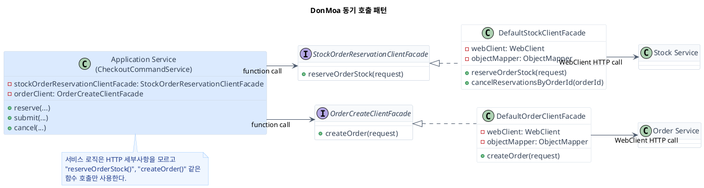
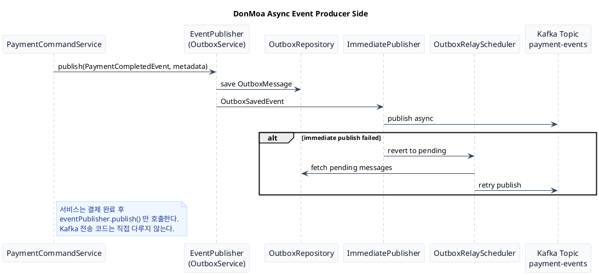
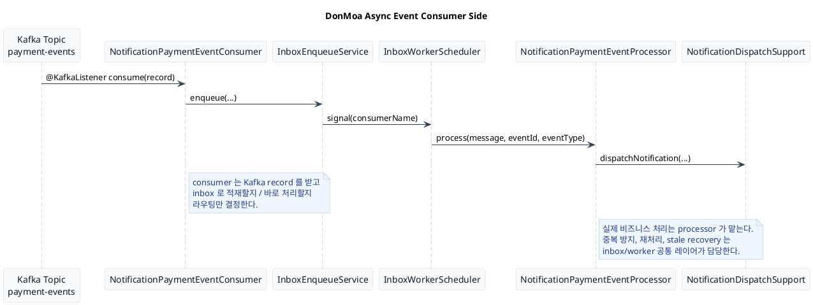

# DonMoa Service Communication Design

이 문서는 `서비스 간 통신 설계`를 발표용으로 설명하기 위한 기준 문서다.  
핵심은 `왜 동기/비동기를 나눴는지`, `어떤 기준으로 선택했는지`, `실제로는 어떤 패턴으로 구현했는지`를 한 번에 정리하는 것이다.

---

## 1. 설계 요약

DonMoa는 서비스 간 통신을 하나의 방식으로 통일하지 않았다.  
대신 요청의 성격과 실패 시 처리 전략에 따라 `동기 호출`과 `비동기 처리`를 분리했다.

- `동기 호출`
  즉시 응답을 확인해야 하고, 그 결과에 따라 바로 다음 로직을 진행해야 하는 흐름
- `비동기 처리`
  약간의 지연을 허용할 수 있고, 실패했을 때 재시도하거나 나중에 복구할 수 있는 흐름

즉, 통신 방식을 기술 취향으로 고른 것이 아니라 `업무 흐름의 요구사항`에 맞춰 선택했다.

---

## 2. 동기 / 비동기 분리 기준

### 동기로 처리한 기준

- 응답 결과를 바로 확인해야 할 때
- 응답이 성공해야만 다음 로직을 이어갈 수 있을 때
- 사용자의 요청 응답 안에서 일관된 결과를 보여줘야 할 때
- 실패 시 바로 사용자에게 오류를 반환해야 할 때

대표 예시:
- 상품 정보 조회 후 checkout session 생성
- 재고 선점 결과를 받아야 다음 단계로 진행 가능한 checkout reserve
- 주문 생성 결과를 받아야 session 상태를 바꿀 수 있는 checkout submit

### 비동기로 처리한 기준

- 약간의 지연을 허용할 수 있을 때
- 실패해도 나중에 재시도할 수 있을 때
- 수동 복구나 운영 재처리가 가능할 때
- 연동 실패를 즉시 사용자 응답 실패로 연결하지 않아도 될 때
- 후속 작업 성격의 처리일 때

대표 예시:
- 결제 완료 후 알림 발송
- 결제 완료 후 다른 서비스의 후속 상태 반영
- 미디어 confirm 이후 파생 이미지 생성

---

## 3. 이 설계가 Event Sourcing 인가?

엄밀하게 말하면 `Kafka 기반 Event-Driven Architecture`에 가깝고, 전형적인 `Event Sourcing`과는 다르다.

왜냐하면:

- 서비스의 주 데이터는 각 서비스 DB에 저장된다.
- aggregate 상태를 event store만으로 재구성하는 구조는 아니다.
- 이벤트는 상태 저장의 유일한 원천(source of truth)이라기보다,
  서비스 간 후속 처리를 위한 전파 수단으로 사용된다.

즉 발표에서는 이렇게 표현하는 게 정확하다.

`Kafka 기반 이벤트 드리븐 비동기 처리 구조를 사용했고, 발행 안정성은 outbox로, 소비 안정성은 inbox로 보강했습니다.`

이 표현이 `event sourcing`보다 더 정확하고 설득력 있다.

---

## 4. 동기 통신 설계

### 왜 동기 호출을 facade로 감쌌는가

동기 호출이 많아지면 서비스 코드에 아래가 바로 스며든다.

- HTTP 경로
- WebClient 호출
- 응답 envelope 파싱
- 예외 매핑
- 재시도 / 회로 차단

이렇게 되면 서비스 로직이 비즈니스보다 통신 구현 디테일에 더 많이 잠기게 된다.

그래서 DonMoa는 동기 통신에서 `Facade interface`를 경계로 두고,
서비스 코드에서는 `함수 호출처럼 보이게` 만들었다.

즉 서비스는:

- `findItem()`
- `createOrder()`
- `reserveOrderStock()`

같은 함수만 보고,
실제 WebClient / 응답 파싱 / 예외 처리 / 재시도는 facade 구현체 안으로 숨긴다.

### 발표용 핵심 문장

`동기 통신은 즉시 결과를 확인해야 하는 흐름에 사용했고, 서비스 코드가 HTTP 세부 구현에 잠기지 않도록 facade로 추상화했습니다.`

### PlantUML: 동기 호출 구조

---

## 5. 비동기 통신 설계

### 왜 비동기 처리는 이벤트 기반으로 갔는가

후속 처리 성격의 연동은 아래 특징이 있다.

- 요청 응답 안에서 끝낼 필요가 없다
- 약간의 지연을 허용할 수 있다
- 실패 시 재시도할 수 있다
- 나중에 운영으로 재처리할 수 있다
- 어떤 경우에는 일시 실패를 즉시 무시하고 다음 처리로 넘길 수도 있다

이런 흐름은 동기 HTTP보다 `이벤트 기반 비동기 처리`가 더 적합하다.

### 토픽 설계 기준

토픽은 `payment-events`처럼 큰 도메인 기준으로 묶고,
세부 이벤트는 `eventType`으로 구분했다.

이유는:

- 새 이벤트가 추가될 때마다 토픽을 계속 늘리지 않기 위해
- producer의 변경 범위를 줄이기 위해
- 운영 포인트(ACL, 모니터링, 문서, consumer 설정) 폭증을 막기 위해

대신 consumer 쪽에서는:

- 어떤 `eventType`을 받을지
- 어떤 이벤트만 처리할지
- 어떤 이벤트는 무시할지

를 명확히 관리해야 한다.

### 왜 outbox / inbox를 같이 썼는가

비동기 구조에서 제일 중요한 건:

- 발행 유실 방지
- 중복 소비 방지
- 실패 재처리

이 세 가지다.

그래서 DonMoa는:

- 발행 쪽은 `Outbox`
- 소비 쪽은 `Inbox`

로 안정성을 보강했다.

### 발표용 핵심 문장

`비동기 통신은 약간의 지연을 허용할 수 있고 실패 후 재처리가 가능한 흐름에 적용했고, Kafka 기반 이벤트 전파 위에 outbox/inbox를 얹어서 발행 유실과 중복 소비를 줄였습니다.`

### PlantUML: Producer

### PlantUML: Consumer

---

## 6. 발표에서 이렇게 정리하면 된다

### 동기 통신

`즉시 결과를 확인해야 하고 그 결과에 따라 바로 다음 로직을 진행해야 하는 흐름은 동기로 처리했습니다. 다만 서비스 코드가 HTTP 세부 구현을 직접 알지 않도록 facade로 감쌌습니다.`

### 비동기 통신

`약간의 지연을 허용할 수 있고 실패해도 나중에 재시도하거나 운영으로 복구할 수 있는 흐름은 비동기로 처리했습니다. 발행 유실과 중복 소비를 막기 위해 Kafka 기반 이벤트 전파 위에 outbox와 inbox를 사용했습니다.`

### 한 줄 결론

`결국 저희는 통신 방식을 기술 취향으로 고른 게 아니라, 응답 시점 보장과 실패 처리 전략을 기준으로 동기와 비동기를 분리해 설계했습니다.`
