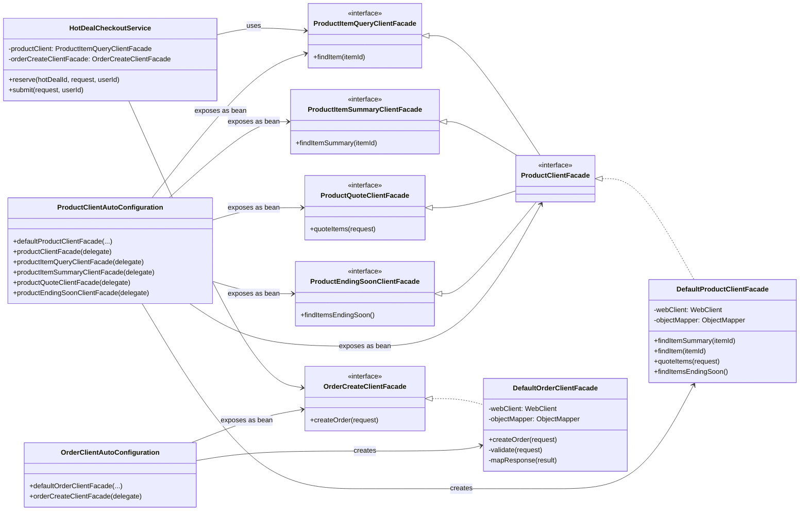
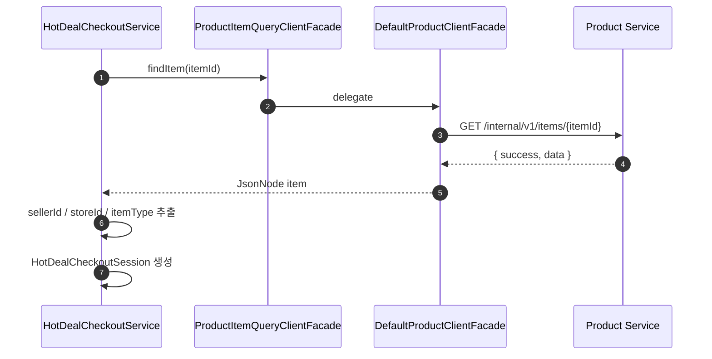
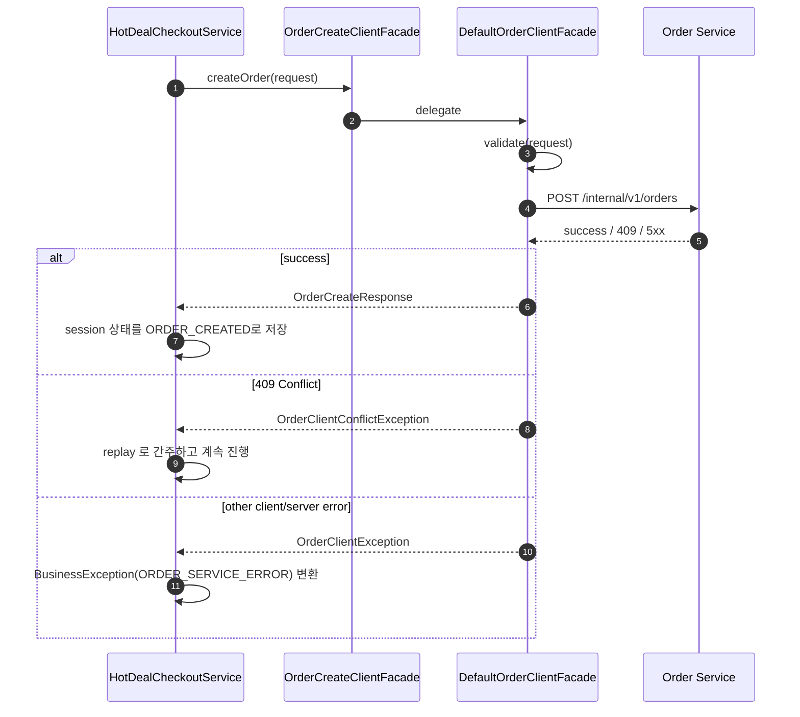

# DonMoa Sync Facade Communication

이 문서는 `draw.io` 대신 Mermaid로 정리한 facade 기반 동기 통신 구조 설명 자료다.
발표나 문서 공유 시 그대로 렌더링해서 사용할 수 있다.

## 1. Class Diagram

## 2. Usage Example: reserve()

## 3. Usage Example: submit()

## 4. Presentation Point

- 서비스는 downstream HTTP 세부사항을 직접 다루지 않고, 비즈니스 의미가 드러나는 facade interface만 사용한다.
- 실제 동기 통신 구현, 응답 파싱, 예외 매핑은 `Default*Facade` 안으로 숨겨진다.
- `AutoConfiguration`이 같은 구현체를 여러 facade bean으로 노출해서, 사용처는 필요한 능력만 주입받을 수 있다.
- 이 패턴 덕분에 application service 코드는 orchestration에 집중하고, 동기 통신 코드는 공통 라이브러리로 재사용된다.
