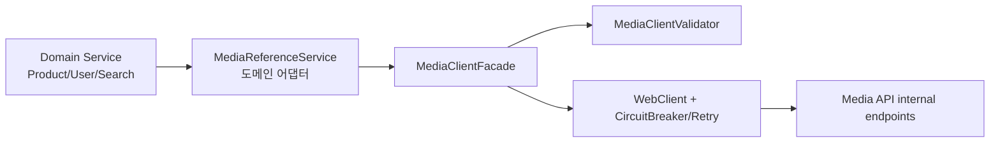
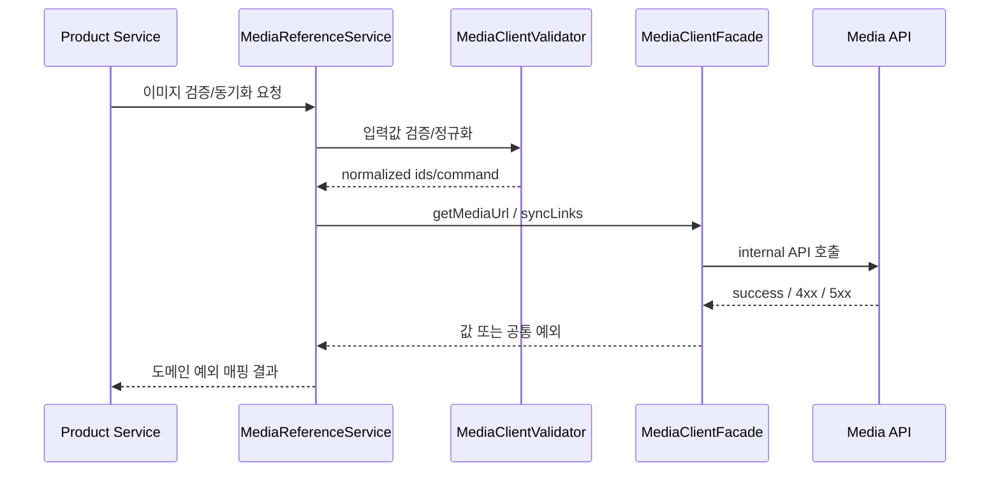
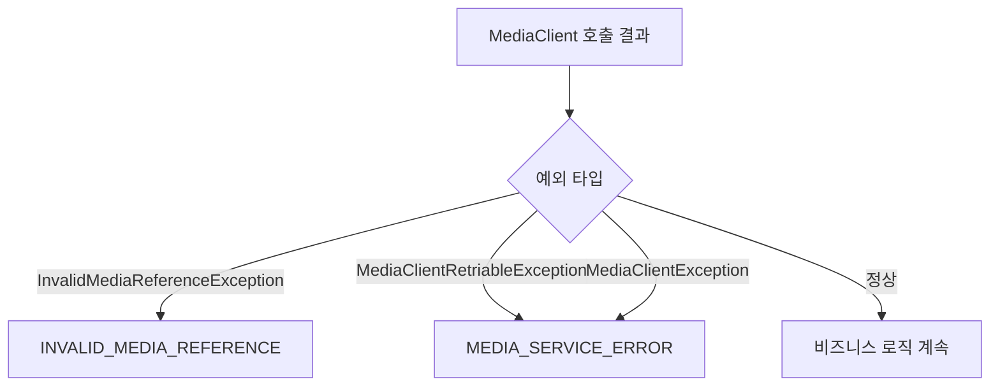

# Media Client 사용 가이드

## 1. 이 문서의 목적

`mediaId` 기반 아키텍처에서 각 도메인이 Media API를 직접 구현하지 않도록, 공통 모듈 `:libs:clients:media-client`를 사용하는 표준 방법을 정리한다.

핵심 원칙은 아래 3가지다.
- 도메인은 `mediaId`를 저장한다.
- URL 생성/정책은 Media 서비스가 책임진다.
- 도메인은 공통 클라이언트 예외를 도메인 에러코드로 매핑한다.

---

## 2. 모듈 구성



구성 요소:
- `MediaClientFacade`
  - `getMediaUrl(mediaId)`
  - `getMediaUrlMap(mediaIds)`
  - `syncLinks(command)`
- `MediaClientValidator`
  - mediaId 유효성 검증
  - 링크 동기화 커맨드 정규화/검증
- 예외 타입
  - `InvalidMediaReferenceException` (입력/참조 오류, 주로 4xx)
  - `MediaClientRetriableException` (네트워크/5xx)
  - `MediaClientException` (기타 호출 실패)

---

## 3. 의존성 추가

`servers/services/<domain>/build.gradle.kts`

```kotlin
implementation(project(":libs:clients:media-client"))
```

`media-client`는 내부적으로 다음을 사용한다.
- `:libs:config:webclient`
- `:libs:config:resilience`

자동 설정(`MediaClientAutoConfiguration`)으로 Bean이 등록되므로 도메인은 바로 주입받아 사용할 수 있다.

---

## 4. 설정 값

기본 URL 설정 우선순위:
1. `app.clients.media.base-url`
2. `app.service.media-url`
3. 기본값 `http://localhost:8094`

예시:

```yaml
app:
  service:
    media-url: ${MEDIA_SERVICE_URL:http://localhost:8094}
```

---

## 5. 도메인 서비스에서 사용하는 방법

### 5.1 권장 패턴: 도메인 어댑터 1개로 감싸기

```java
@Service
@RequiredArgsConstructor
public class MediaReferenceService {

    private final MediaClientFacade mediaClientFacade;
    private final MediaClientValidator mediaClientValidator;

    public String resolveMediaUrl(Long mediaId) {
        try {
            return mediaClientFacade.getMediaUrl(mediaId);
        } catch (InvalidMediaReferenceException e) {
            throw new BusinessException(ProductErrorCode.INVALID_MEDIA_REFERENCE, e);
        } catch (MediaClientException e) {
            throw new BusinessException(ProductErrorCode.MEDIA_SERVICE_ERROR, e);
        }
    }
}
```

### 5.2 호출 시퀀스



---

## 6. 오류 매핑 기준

### 6.1 공통 예외 -> 도메인 예외



권장 매핑:
- `InvalidMediaReferenceException` -> 도메인 `BAD_REQUEST` 계열
- `MediaClientRetriableException`, `MediaClientException` -> 도메인 `BAD_GATEWAY` 계열

---

## 7. 링크 동기화(syncLinks) 사용 규약

링크 동기화 커맨드는 다음 구조를 권장한다.

```json
{
  "ownerType": "ITEM",
  "ownerId": 100,
  "sets": [
    {"usageType": "THUMBNAIL", "mediaIds": [10]},
    {"usageType": "GALLERY", "mediaIds": [20, 21]}
  ]
}
```

`MediaClientValidator`가 아래를 보장한다.
- `ownerType` 필수
- `ownerId` 양수
- `usageType` 필수
- `mediaIds`는 양수/중복 제거

---

## 8. 신규 도메인 온보딩 체크리스트

1. `:libs:clients:media-client` 의존성 추가
2. 도메인 어댑터(`*MediaReferenceService`) 생성
3. 공통 예외를 도메인 에러코드로 매핑
4. 쓰기 경로에서 `mediaId` 검증 호출
5. 조회 경로에서 URL 필요 시 `getMediaUrl` 또는 `getMediaUrlMap` 사용
6. 테스트 추가
   - 정상
   - invalid mediaId
   - network/5xx

---

## 9. 운영 관점 주의사항

- 클라이언트 모듈은 기술 책임만 가진다.
  - retry/circuit breaker
  - 요청/응답 파싱
  - 입력 검증
- 비즈니스 정책은 도메인에 둔다.
  - 어떤 상황을 사용자 에러로 볼지
  - 어떤 응답 코드를 줄지
- URL 정책(`PUBLIC_DOMAIN`, `SIGNED_URL`)은 Media 서비스에서만 결정한다.

