# Media API 내부 운영/개발 가이드

## 1. 문서 목적
- 이 문서는 `media-api`를 사용하는 내부 개발자를 위한 단일 기준 문서다.
- 기존 분산 문서를 합치고, 설정 키 의미와 실제 유즈케이스를 한 번에 이해할 수 있게 정리한다.
- 다이어그램은 모두 Mermaid 기준으로 작성한다.

## 2. 시스템 한눈에 보기

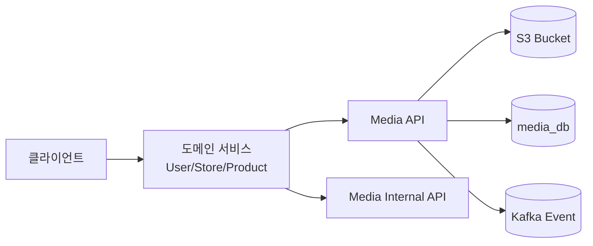

## 3. 설정 키와 의미

### 3.1 `media.s3.*`

| 설정 키 | 기본값 | 의미 | 실무 주의점 |
|---|---|---|---|
| `media.s3.region` | `ap-northeast-2` | S3 및 Presigner 리전 | 버킷 리전과 반드시 일치 |
| `media.s3.bucket` | `team2-donmoa-media-raw` | 원본 오브젝트 저장 버킷 | Public Access Block 유지 |
| `media.s3.key-prefix` | `team2-donmoa-media` | object key 공통 prefix | 환경별 prefix 분리 권장 |
| `media.s3.presigned-put-ttl-seconds` | `300` | 업로드 URL 만료 시간(초) | 너무 길면 오용 위험, 너무 짧으면 UX 저하 |
| `media.s3.max-file-size-bytes` | `52428800` | 업로드 최대 파일 크기 | 클라이언트 제한값과 동일하게 맞춤 |
| `media.s3.cloudfront-domain` | 빈값 | 조회 URL 기본 도메인 | 미설정 시 S3 URL fallback |

### 3.2 `media.cleanup.*`

| 설정 키 | 기본값 | 의미 | 실무 주의점 |
|---|---|---|---|
| `media.cleanup.cron` | `0 */10 * * * *` | 만료 업로드 정리 주기 | 트래픽 낮은 시간대 권장 |
| `media.cleanup.batch-size` | `100` | 1회 정리 처리량 | DB/S3 부하 보며 조정 |
| `media.cleanup.delete-object-enabled` | `false` | `true`면 EXPIRED 처리와 함께 S3 삭제 시도 | 운영 초기에는 `false` + Lifecycle 권장 |

### 3.3 `media.url.*`

| 설정 키 | 기본값 | 의미 | 실무 주의점 |
|---|---|---|---|
| `media.url.access-type` | `PUBLIC` | URL 접근 정책 | `SIGNED_URL` 전환 시 TTL/재발급 동시 설계 |
| `media.url.signed-url-ttl-seconds` | `300` | 서명 URL 만료 시간 | 클라이언트 선제 갱신 필요 |
| `media.url.default-cache-control` | `public, max-age=604800, stale-while-revalidate=60` | 일반 자산 캐시 정책 | 경로 버저닝 전제 |
| `media.url.thumbnail-cache-control` | `public, max-age=31536000, immutable` | 썸네일 캐시 정책 | 썸네일 교체는 키 변경으로 처리 |

### 3.4 `app.gateway-security.*` (media-api 관점)

| 설정 키 | 기본값 | 의미 | 실무 주의점 |
|---|---|---|---|
| `app.gateway-security.enabled` | `true` | 게이트웨이 헤더 검증 활성화 | 로컬 단독 테스트 때만 신중히 비활성화 |
| `app.gateway-security.gateway-auth-enabled` | `true` | 내부 인증 헤더 검증 활성화 | 서비스 간 직접 호출 정책과 합의 필요 |
| `app.gateway-security.required-paths` | `/api/v1/media/**` | 외부 API 보호 경로 | 공개 API는 제외 경로 명시 |
| `app.gateway-security.excluded-paths` | actuator/swagger | 검증 제외 경로 | 운영에서 Swagger 노출 정책 분리 |

## 4. 공통 규칙
- 업로드는 반드시 `intent -> S3 PUT -> confirm` 순서를 따른다.
- `confirm` 전 상태(`PENDING_UPLOAD`)의 mediaId는 비즈니스 연결에 사용하지 않는다.
- 다중 이미지 편집은 `links/sync`로 최종 상태를 한 번에 반영한다.
- `links/sync`는 부분 수정 API가 아니라 전체 치환 API다.
- `THUMBNAIL`은 owner 기준 최대 1개만 허용한다.

## 5. 유즈케이스 A: 프로필 이미지 (1:1)

### 5.1 언제 쓰나
- 사용자 프로필 대표 이미지 1개를 유지하는 케이스.
- owner: `USER_PROFILE`, usage: `PROFILE`.

### 5.2 Flowchart

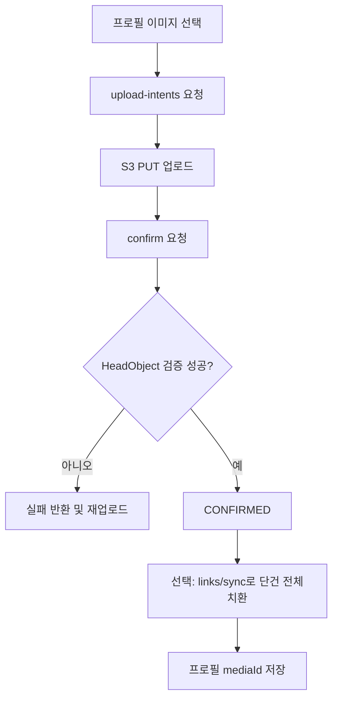

### 5.3 Sequence Diagram

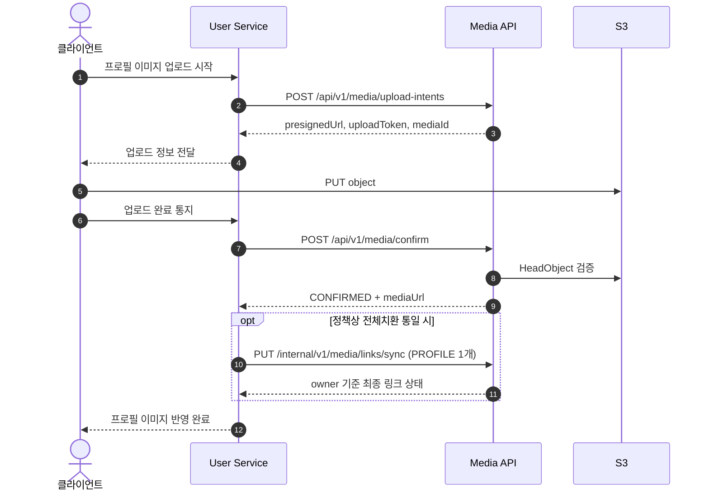

### 5.4 핵심 체크
- 1:1 케이스라도 팀 정책상 동기화 규칙을 통일하려면 `links/sync` 단건 호출을 권장한다.
- 재업로드 시 이전 이미지 링크 정리는 `links/sync`가 가장 명확하다.

## 6. 유즈케이스 B: 스토어 이미지 (1:N)

### 6.1 언제 쓰나
- 스토어 대표 썸네일 + 갤러리 다건(순서 포함) 편집 케이스.
- owner: `STORE`, usage: `THUMBNAIL`, `GALLERY`.

### 6.2 Flowchart

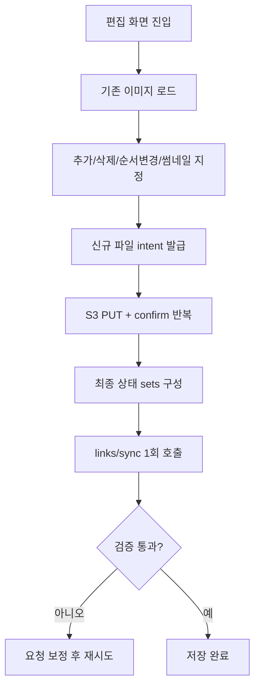

### 6.3 Sequence Diagram

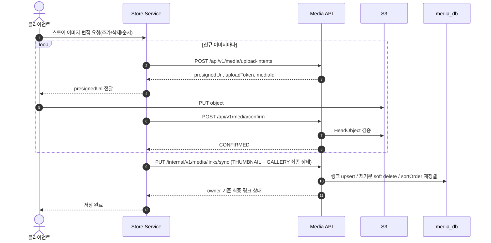

### 6.4 핵심 체크
- `links/sync` 요청의 `sets`가 최종 정답이다.
- 중간 상태를 여러 번 patch하지 말고, 편집 완료 시점에 1회 반영한다.
- `THUMBNAIL`은 최대 1개, `mediaId` 중복은 usage 내/usage 간 모두 금지다.

## 7. 유즈케이스 C: 이미지 전체 제거

### 7.1 Flowchart

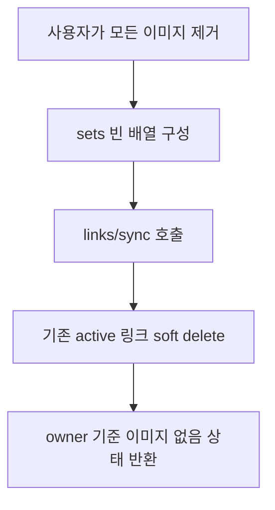

### 7.2 Sequence Diagram

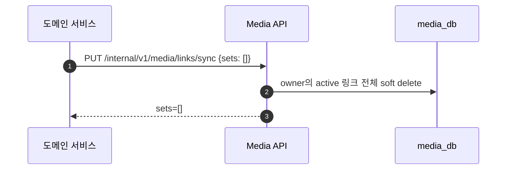

### 7.3 핵심 체크
- 비즈니스 엔티티 썸네일 필드도 함께 null 처리해야 최종 상태가 일관된다.

## 8. 유즈케이스 D: URL 재조회/재발급

### 8.1 Flowchart

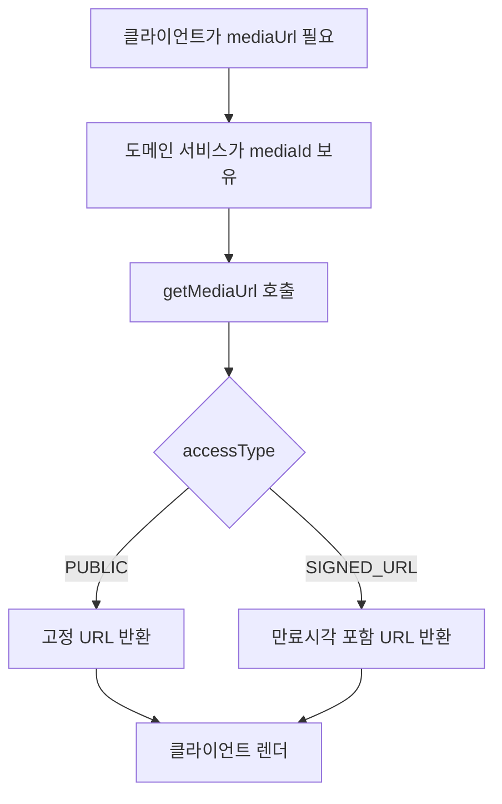

### 8.2 Sequence Diagram

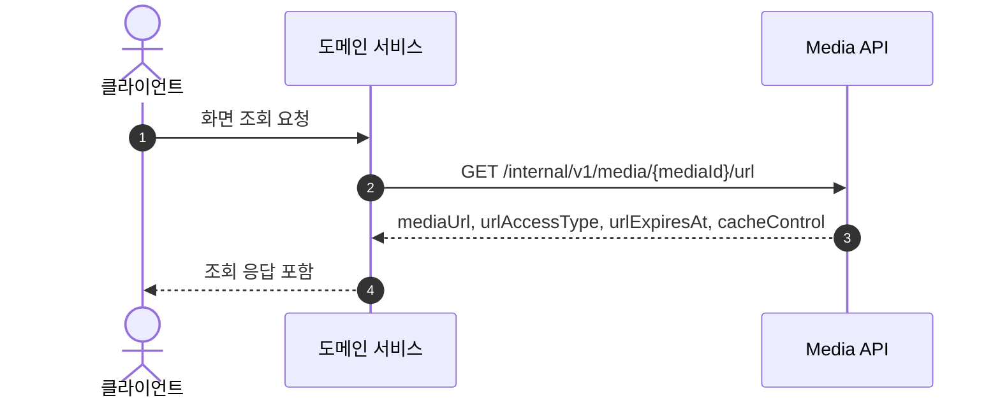

## 9. 유즈케이스 E: 만료 업로드 정리 스케줄러

### 9.1 Flowchart

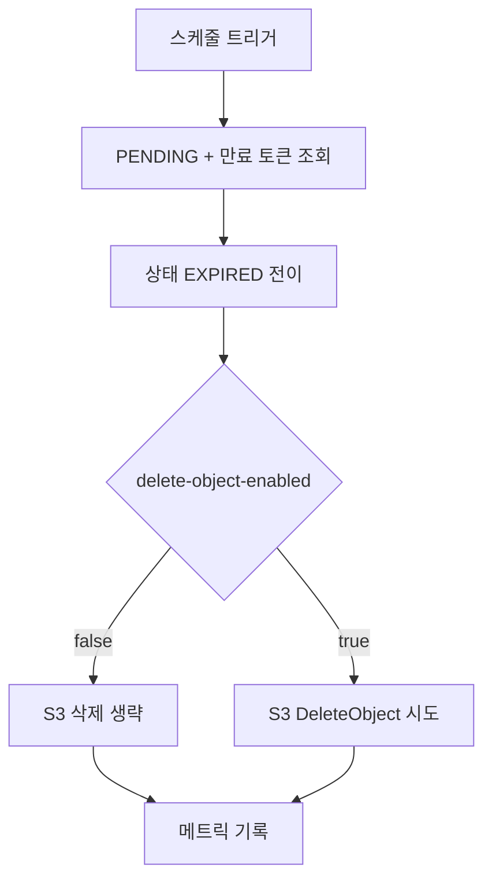

### 9.2 Sequence Diagram

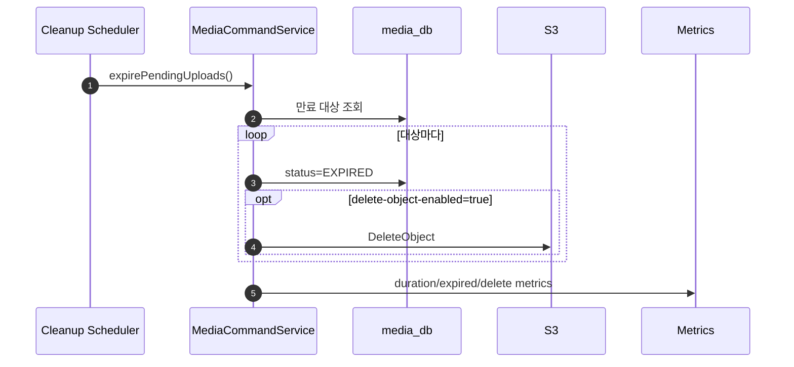

## 10. 운영 시 추천 기본값
- 로컬 개발:
  - `MEDIA_CLEANUP_DELETE_OBJECT_ENABLED=true` (빠른 검증)
  - `MEDIA_S3_PRESIGNED_PUT_TTL_SECONDS=300`
- 스테이징:
  - `MEDIA_CLEANUP_DELETE_OBJECT_ENABLED=false`
  - S3 Lifecycle 정책 동시 적용
- 운영:
  - 초기: `delete-object-enabled=false`로 시작
  - 관측 안정화 후 점진적으로 `true` 전환 검토

## 11. 워커 개발 전 확정해야 할 것
- 이벤트 발행 시점:
  - 최소 `media.confirmed` 유지
  - 필요 시 `links.synced` 신규 이벤트 정의
- 재처리 정책:
  - 재시도 횟수, 백오프, DLQ 기준
- idempotency 기준 키:
  - `mediaId` 단위 처리인지
  - `ownerType + ownerId + usageType + sortOrder` 상태 단위인지
